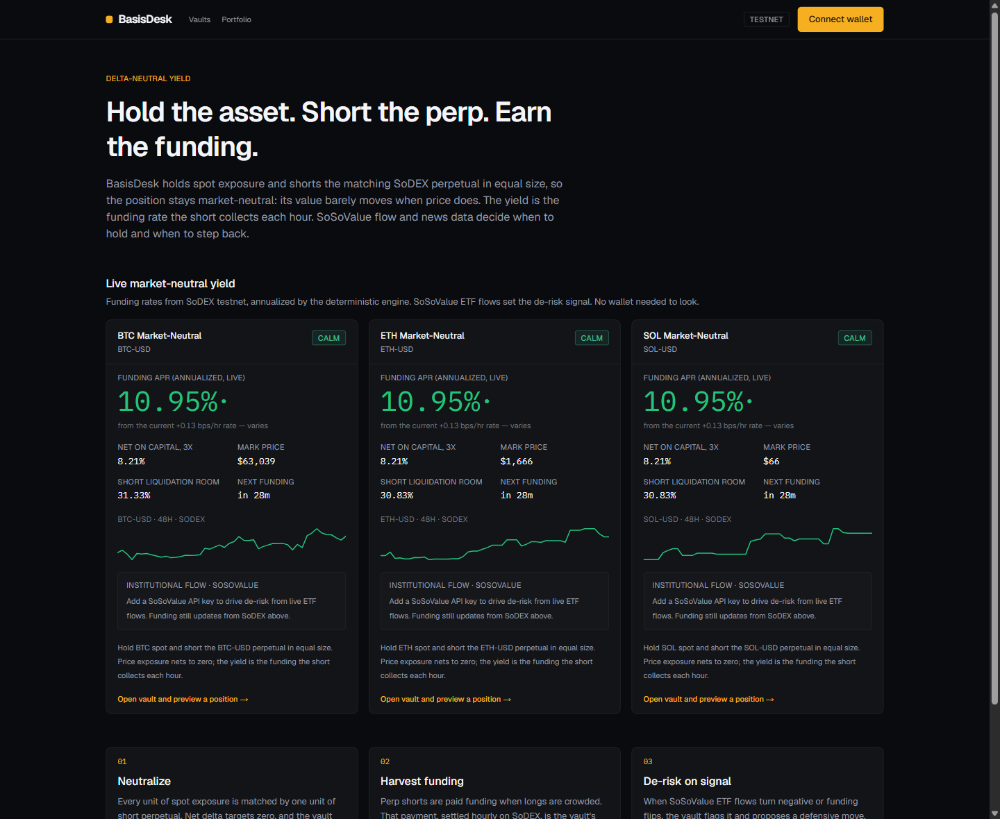
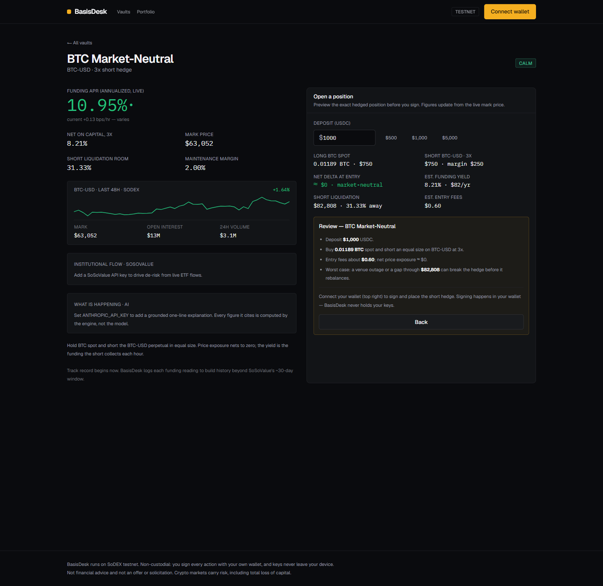
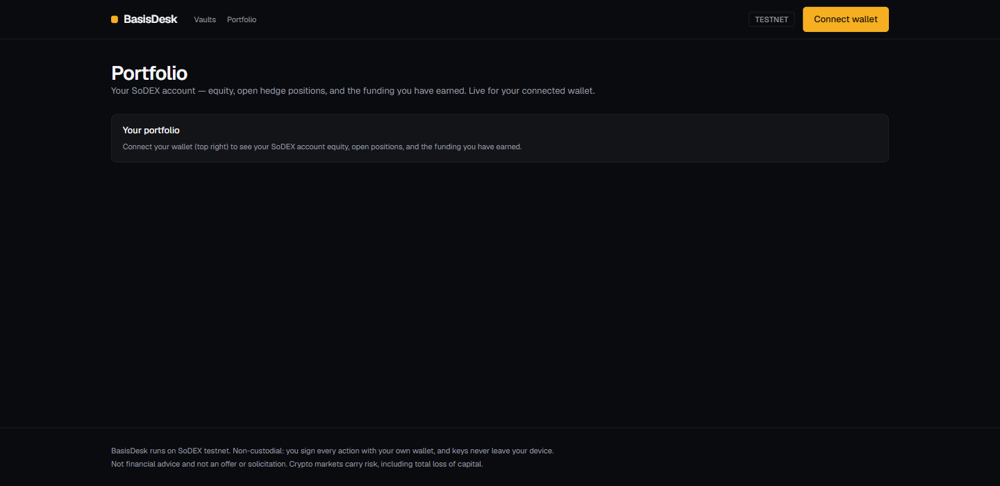
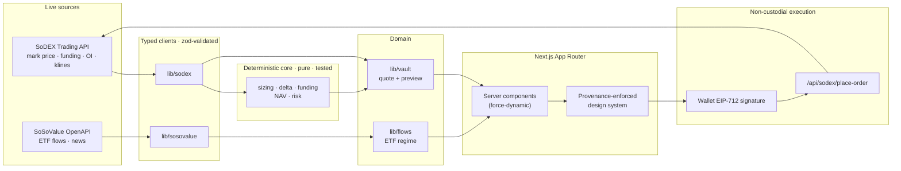

<div align="center">

# BasisDesk

**Delta-neutral on-chain yield.** Hold the asset, short the matching SoDEX perpetual in equal size, and harvest the funding rate — while net price exposure stays near zero.

[](https://basisdesk.vercel.app)
[](LICENSE)
[](#testing)
[](https://nextjs.org)
[](https://www.typescriptlang.org)

**[Open the live app →](https://basisdesk.vercel.app)**

</div>

<br/>



---

## What it is

BasisDesk packages the **basis trade** — the same delta-neutral strategy that grew Ethena to multi-billion scale — as an on-chain vault driven by live data.

For every unit of spot exposure the vault holds, it shorts one unit of the matching perpetual on [SoDEX](https://sodex.com). If price moves, the two legs cancel, so the position stays market-neutral. The yield is the **funding rate** the short collects each hour — paid by crowded longs, not by token inflation. [SoSoValue](https://sosovalue.com) spot-ETF flow data decides when to step back: when institutions turn to net outflows, the vault's de-risk signal escalates.

> One user, one job: a crypto holder who wants a steady, hedged return on BTC, ETH, or SOL — without day-trading and without the price risk of just holding.

## Why it matters

Most "yield" in crypto is either directional risk in disguise or inflationary token emissions. The basis trade is different: a hedged position whose return comes from market structure (funding), with price risk engineered out. BasisDesk makes that strategy legible and auditable:

- Every number on screen traces to a live API or on-chain read, with its source and timestamp.
- All financial math runs in a deterministic, unit-tested core — never inside a language model.
- It is non-custodial by construction: you sign every action in your own wallet, and keys never touch the backend.

## How it works

Deposit `$1,000` into the BTC vault and the engine sizes the exact hedged position from the live mark price:

| Leg | What happens |
| --- | --- |
| **Long spot** | Buy ~`$750` of BTC |
| **Short perp** | Post ~`$250` margin to short an equal-sized BTC-USD perpetual at 3x |
| **If BTC drops 20%** | The spot leg loses; the short gains the same amount. Net value barely moves. |
| **The yield** | The funding rate the short collects each hour, annualized to an APR |

When SoSoValue ETF flows turn to net outflows, the risk badge moves from **Calm** to **De-risk** and the vault proposes a defensive move. Nothing executes without your signature.

## Key features

- **Live funding → APR.** SoDEX mark prices and funding rates are read per request and annualized by the deterministic engine. The landing shows real market-neutral funding APR with source provenance — no wallet or key required.
- **Live market context.** A 48-hour price chart, open interest, and 24-hour volume per market, straight from SoDEX `klines` and `tickers`.
- **Deposit preview + risk receipt.** The exact hedged position (spot quantity, short notional, margin, liquidation price, entry fees, zero entry delta) and a pre-trade receipt that restates size, fees, and worst case before you sign.
- **Non-custodial execution.** The hedge order is signed in your wallet with EIP-712 and submitted to SoDEX. The signing scheme is ported and verified against SoDEX's public SDK — round-trip tested, not guessed.
- **Portfolio + redeem.** A connected-wallet view of your SoDEX account equity, open positions, and funding earned, with one-signature position close.
- **SoSoValue de-risk signal.** Daily ETF-flow regime (inflow/outflow streaks, flips) drives each vault's risk stance, plus the grounded news "why."
- **Grounded AI narration.** An optional model narrates the figures the engine computed — it never does arithmetic, and every sentence cites its datapoint.

## Screenshots

| Vault detail — funding, live chart, deposit preview, risk receipt | Portfolio |
| --- | --- |
|  |  |

## Architecture

BasisDesk composes a pure finance core with typed data clients, behind Next.js server components that read live data per request. Every user-facing figure flows through the tested core, so the numbers are reproducible.



**Layers**

1. **Deterministic core (`src/lib/core`)** — framework-free, network-free, fully unit-tested. Sizing, net delta, funding annualization, NAV (with a price-invariance property that proves market-neutrality), and risk classification. All money math uses `dnum` fixed-point.
2. **Data clients** — `src/lib/sodex` (public market data + EIP-712 signing + order submission) and `src/lib/sosovalue` (ETF flows + news, gated behind `SOSOVALUE_API_KEY`). Each is a typed fetch with timeout, retry, 429 handling, and zod validation, returning a discriminated result so the UI renders real error states instead of throwing.
3. **Domain (`src/lib/vault`, `src/lib/flows`)** — composes core + clients into product concepts: the vault quote, the deposit preview, and the ETF-flow regime that escalates risk to de-risk on outflows.
4. **UI (`src/app`, `src/components`)** — App Router. Server components fetch live data per request and stream into a design system whose `ValueWithProvenance` primitive requires a `source`, so an unsourced number is structurally impossible.

See [`docs/ARCHITECTURE.md`](docs/ARCHITECTURE.md) for the full write-up and key decisions.

## Data lineage

Every user-facing number maps to a real upstream (full ledger in [`docs/CLAIMS.md`](docs/CLAIMS.md)):

| Surface | Source |
| --- | --- |
| Funding rate, mark price, OI, 24h volume, market spec | SoDEX `GET /markets/mark-prices`, `/markets/tickers`, `/markets/symbols`, `/markets/{symbol}/klines` |
| Funding APR, capital yield, liquidation, delta, NAV | Deterministic core, from the live mark + spec |
| Account id, equity, positions, funding earned | SoDEX `GET /accounts/{address}/{state,positions,fundings}` |
| Institutional flow regime | SoSoValue `GET /etfs/summary-history` |
| Grounded news | SoSoValue `GET /news/featured` |
| Order signing + submission | EIP-712 on ValueChain (chainId 138565) → SoDEX `POST /api/v1/perps/trade/orders` |

## Tech stack

| Area | Choice |
| --- | --- |
| Framework | Next.js 15.5 (App Router), React 19 |
| Language | TypeScript (strict) |
| Styling | Tailwind v4, token-driven design system |
| Money math | `dnum` (bigint fixed-point — no IEEE floats for amounts/prices) |
| Validation | `zod` on every external response |
| Wallet / signing | `wagmi` + `viem` (EIP-712, injected connector) |
| AI (optional) | AI SDK + `@ai-sdk/anthropic`, JSON-schema-constrained |
| Tests | Vitest |
| Hosting | Vercel |

## Project structure

```
src/lib/core/        deterministic finance engine (sizing, delta, funding, NAV, risk) — pure, tested
src/lib/sodex/       SoDEX client: market data, EIP-712 signing, order submission
src/lib/sosovalue/   SoSoValue OpenAPI client (ETF flows, news) — gated behind SOSOVALUE_API_KEY
src/lib/flows/       ETF-flow regime engine: streak/flip detection -> de-risk stance
src/lib/vault/       vault catalog + quote + deposit preview, composed from core + clients
src/lib/format/      the single number-formatting module (dnum-backed, null-safe)
src/components/       design-system primitives + vault UI
src/app/              App Router pages + API routes (server components read live per request)
docs/                 ARCHITECTURE, CLAIMS (data lineage), SCOPE, SUBMISSION
```

## Getting started

Requires Node 20+ and pnpm.

```bash
git clone https://github.com/Ritik200238/BasisDesk.git
cd BasisDesk
pnpm install
cp .env.example .env.local   # optional keys; see below
pnpm dev                     # http://localhost:3000
```

SoDEX public market data needs no key, so the landing shows live funding immediately. Add keys to light up the gated layers:

| Variable | Enables |
| --- | --- |
| `SOSOVALUE_API_KEY` | Institutional-flow de-risk signal + grounded news |
| `ANTHROPIC_API_KEY` | Grounded AI narration |
| `CRON_SECRET` | Protects the funding/flow snapshot cron |

> On Windows, if local dev shows a React hook error, the folder path is mixed-case — run from a consistently-cased path. A normal clone and Vercel are unaffected.

### Testing

```bash
pnpm test        # 68 unit tests: finance core, formatting, clients, flow regime, signing
pnpm typecheck   # tsc --noEmit
```

The signing module is verified the way SoDEX's own SDK tests verify it: the canonical order JSON matches the spec byte-for-byte, and a sign → recover round-trip returns the signer address.

## Deployment

Deploys on Vercel. Next.js is auto-detected and pnpm is used from the lockfile. The base demo needs no environment variables, since SoDEX market data is public. Add the keys above in **Project → Settings → Environment Variables** to enable the gated layers. `vercel.json` schedules `/api/cron/snapshot` daily to accumulate funding/flow history.

```bash
vercel deploy --prod
```

## Security & privacy

- **Non-custodial by construction.** The backend only ever sees public addresses and signed intents. There is no code path that accepts a private key, and signing happens entirely in the user's wallet.
- **Gated, never mocked.** A missing key or a failed upstream renders an explicit state with the reason — never a fabricated value. Enforced at the client (typed error kinds) and the UI (loading / empty / error / stale / populated states per surface).
- **Hardened responses.** Content-Security-Policy, HSTS, `X-Frame-Options: DENY`, `X-Content-Type-Options`, Referrer-Policy, and Permissions-Policy on every response.
- **Validated, rate-limited routes.** The order-submission route validates the full payload and the `0x01` wire-signature shape with zod, behind a per-IP rate limit.
- **Pre-trade confirmation.** Every fund-moving action passes a receipt restating action, size, estimated fees, and worst-case downside before signing.

## Status

- **Live:** read-only insight (funding, market charts, flow), deposit preview + risk receipt, non-custodial sign-and-submit (verified against SoDEX testnet), connected-wallet portfolio + redeem.
- **Gated on external access:** the SoSoValue and AI layers light up when their keys are set; live order acceptance requires a whitelisted SoDEX testnet account (the full sign-and-submit path is built and verified up to that gate).

See [`docs/SCOPE.md`](docs/SCOPE.md) for the running build ledger.

## Contributing

Issues and pull requests are welcome. Before a PR: `pnpm test` and `pnpm typecheck` must pass, every user-facing number must trace to a real source, and changes follow the operating rules in [`CLAUDE.md`](CLAUDE.md) (real data only, deterministic math, provenance on every figure).

## License

[MIT](LICENSE) © 2026 Ritik Pandey

## Author

Built by **Ritik Pandey** — [@Ritik200238](https://github.com/Ritik200238).

## Disclaimer

Not financial advice, and not an offer or solicitation. BasisDesk is non-custodial and never holds keys or funds. Crypto markets carry risk, including total loss of capital. Testnet only.
