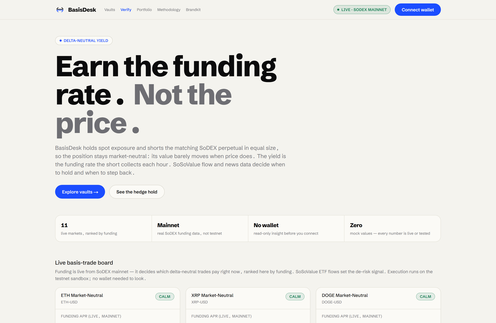
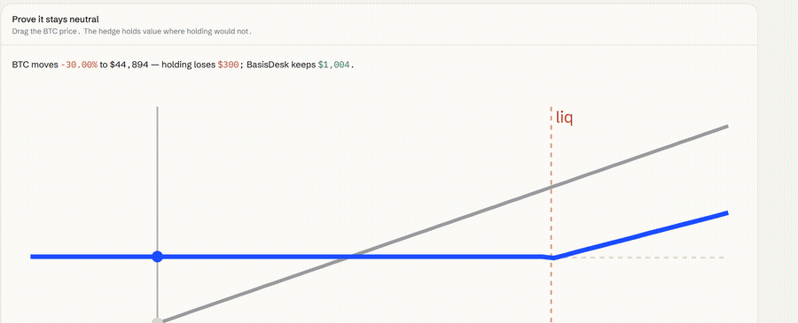
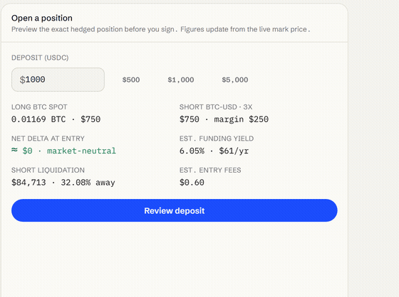
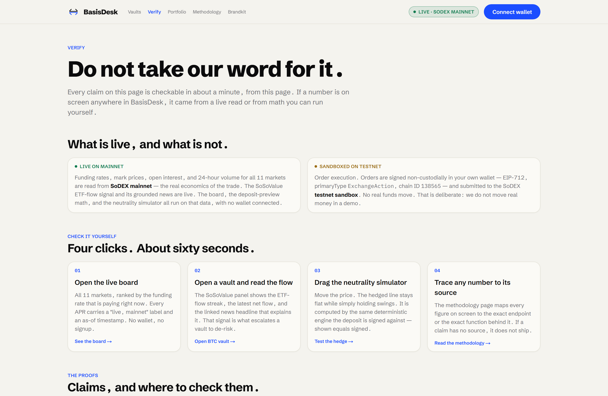
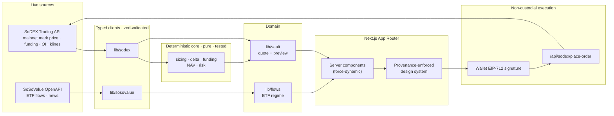

<div align="center">


# BasisDesk

### Earn real yield on crypto — without betting on the price.

A delta-neutral yield desk: hold the asset, short the matching SoDEX perpetual, and harvest the funding rate. Live on **SoDEX mainnet** across **11 markets**, with the de-risk signal driven by **SoSoValue** institutional-flow data.

[](https://basisdesk.vercel.app)
[](https://basisdesk.vercel.app/verify)
[](#testing)
[](LICENSE)
[](https://www.typescriptlang.org)

**[Open the live app →](https://basisdesk.vercel.app)**  ·  **[Verify every claim →](https://basisdesk.vercel.app/verify)**



</div>

---

> **11 live markets on real SoDEX _mainnet_ funding data.** Fully usable **with no wallet** — the board, funding, ETF-flow signals, deposit preview, and the neutrality simulator all render for a first-time visitor. Order execution is signed **non-custodially** and runs on the SoDEX **testnet sandbox**, so no real funds move. Every number is a live read or unit-tested math; **nothing on screen is mocked.**

## The problem

Crypto holders are stuck between two bad options: sit on your coins and earn nothing while every crash keeps you up at night — or chase DeFi "yield" that is usually just a token printing more of itself, and still take the full ride down. Earning a return and protecting your capital have always been treated as opposites.

## What BasisDesk does

BasisDesk packages the **basis trade** — the same delta-neutral strategy that grew [Ethena](https://ethena.fi) to multi-billion scale — as a one-click on-chain vault. For every unit of spot exposure the vault holds, it shorts one unit of the matching perpetual on [SoDEX](https://sodex.com). If price moves, the two legs cancel, so the position stays market-neutral. The yield is the **funding rate** the short collects each hour — paid by crowded longs, not by token inflation.

**The hedge holds — proven live, not asserted:**

<div align="center">

</div>

Drag the price on any vault and the hedged line (blue) stays flat while simply holding (grey) tracks the market one-for-one. It is computed by the same deterministic engine the deposit is signed against — *what you see is what you sign.*

## Why it matters

Most "yield" in crypto is directional risk in disguise or inflationary token emissions. The basis trade is different: a hedged position whose return comes from **market structure** (funding), with price risk engineered out. BasisDesk makes that strategy legible and auditable:

- Every number on screen traces to a live API or on-chain read, with its source and timestamp.
- All financial math runs in a deterministic, unit-tested core — **never** inside a language model.
- It is non-custodial by construction: you sign every action in your own wallet, and keys never touch the backend.

## How it works

Deposit into a vault and the engine sizes the exact hedged position from the live mark price. The net delta stays **≈ $0 at any size** — market-neutral by construction:

<div align="center">

</div>

| Leg | What happens |
| --- | --- |
| **Long spot** | Buy ~75% of your deposit in the asset |
| **Short perp** | Post ~25% margin to short an equal-sized perpetual at 3× |
| **If the price drops** | The spot leg loses; the short gains the same amount. Net value barely moves. |
| **The yield** | The funding rate the short collects each hour, annualized to an APR |

When SoSoValue ETF flows turn to net outflows, the risk badge moves from **Calm** to **De-risk** and the vault proposes a defensive move — with the linked news headline as the reason. Nothing executes without your signature, behind a pre-trade receipt that restates size, fees, and worst-case downside.

## Live now — 11 markets, real mainnet data, no wallet

The board ranks every market by the funding it is paying *right now*:

**BTC · ETH · SOL · XRP · DOGE · AVAX · LTC · LINK · HBAR · SOSO · gold (XAUT)**

- **Market data is live from SoDEX mainnet** — funding, mark prices, open interest, and 24h volume are the real economics of the trade.
- **The SoSoValue de-risk signal is live** for every asset it tracks ETF flows for; assets without a spot ETF (gold, SOSO) show an honest "no ETF-flow data" state rather than inventing one.
- **Order execution is signed non-custodially and runs on the SoDEX testnet sandbox** — no real funds move. Mainnet execution is the next build (see [Roadmap](#roadmap)).

## Proof — don't take our word for it

The **[Verify page](https://basisdesk.vercel.app/verify)** lets anyone check every claim in about a minute, with each one linked to something clickable:

<div align="center">

</div>

- **11 live markets** on real SoDEX mainnet funding — check the rates yourself.
- **80 unit tests**, all public — the finance core, both API clients, the ETF-flow engine, and the EIP-712 signing path.
- **The market-neutrality invariant** — a test that sizes a $1,000 position at $50k, recomputes NAV at $40k and $60k, and asserts $1,000 both times ([read the test](https://github.com/Ritik200238/BasisDesk/blob/main/src/lib/core/vault.test.ts)). If it fails, the product is lying — so it is a hard release gate.
- **Zero mocked values** — disconnect the SoSoValue key and the flow surfaces go to an explicit empty state, never a placeholder.

## Key features

- **11-market live board.** Real SoDEX mainnet funding, annualized by the deterministic engine and ranked so the trades currently paying lead. Each vault shows whether the short earns or pays — no wallet or key required.
- **The SoSoValue brain.** Daily ETF-flow data is reduced to a per-asset regime (direction, streak, magnitude vs. the recent norm, short-term trend) that yields a conviction and a de-risk stance, plus the grounded news "why."
- **Deposit preview + risk receipt.** The exact hedged position (spot quantity, short notional, margin, liquidation price, entry fees, net delta ≈ $0) and a pre-trade receipt restating size, fees, and worst case before you sign.
- **Interactive neutrality proof.** Drag the price and watch the hedge hold — the same deterministic math the deposit is signed against.
- **Non-custodial execution.** The hedge order is signed in your wallet with EIP-712 and submitted to SoDEX. The signing scheme is ported and verified against SoDEX's public SDK — round-trip tested, not guessed.
- **Grounded AI narration.** An optional model (NVIDIA, Llama 3.1 8B) narrates the figures the engine computed — it never does arithmetic, cites its datapoint, and falls back to a deterministic grounded summary when unset.

## Architecture

BasisDesk composes a pure finance core with typed data clients, behind Next.js server components that read live data per request. Every user-facing figure flows through the tested core, so the numbers are reproducible.


```mermaid
flowchart LR
  subgraph live["Live sources"]
    A1["SoDEX Trading API<br/>mainnet mark price · funding · OI · klines"]
    A2["SoSoValue OpenAPI<br/>ETF flows · news"]
  end
  subgraph clients["Typed clients · zod-validated"]
    B1["lib/sodex"]
    B2["lib/sosovalue"]
  end
  subgraph core["Deterministic core · pure · tested"]
    C1["sizing · delta · funding<br/>NAV · risk"]
  end
  subgraph domain["Domain"]
    D1["lib/vault<br/>quote + preview"]
    D2["lib/flows<br/>ETF regime"]
  end
  subgraph ui["Next.js App Router"]
    E1["Server components<br/>(force-dynamic)"]
    E2["Provenance-enforced<br/>design system"]
  end
  subgraph exec["Non-custodial execution"]
    F1["Wallet EIP-712 signature"]
    F2["/api/sodex/place-order"]
  end

  A1 --> B1
  A2 --> B2
  B1 --> C1
  B1 --> D1
  B2 --> D2
  C1 --> D1
  D1 --> E1
  D2 --> E1
  E1 --> E2
  E2 --> F1
  F1 --> F2
  F2 --> A1
```

**Layers**

1. **Deterministic core (`src/lib/core`)** — framework-free, network-free, fully unit-tested. Sizing, net delta, funding annualization, NAV (with a price-invariance property that proves market-neutrality), and risk classification. All money math uses `dnum` fixed-point.
2. **Data clients** — `src/lib/sodex` (public market data + EIP-712 signing + order submission) and `src/lib/sosovalue` (ETF flows + news, gated behind `SOSOVALUE_API_KEY`, cached in the cross-instance Data Cache). Each is a typed fetch with timeout, retry, 429 handling, and zod validation, returning a discriminated result so the UI renders real error states instead of throwing.
3. **Domain (`src/lib/vault`, `src/lib/flows`)** — composes core + clients into the vault quote, the deposit preview, and the ETF-flow regime that escalates risk to de-risk on outflows.
4. **UI (`src/app`, `src/components`)** — App Router. Server components fetch live data per request and stream into a design system whose `ValueWithProvenance` primitive requires a `source`, so an unsourced number is structurally impossible.

See [`docs/ARCHITECTURE.md`](docs/ARCHITECTURE.md) for the full write-up.

## Data lineage

Every user-facing number maps to a real upstream (full ledger in [`docs/CLAIMS.md`](docs/CLAIMS.md)):

| Surface | Source |
| --- | --- |
| Funding rate, mark price, OI, 24h volume, market spec | SoDEX **mainnet** `GET /markets/mark-prices`, `/markets/tickers`, `/markets/symbols`, `/markets/{symbol}/klines` |
| Funding APR, capital yield, liquidation, delta, NAV | Deterministic core, from the live mark + spec |
| Account id, equity, positions, funding earned | SoDEX `GET /accounts/{address}/{state,positions,fundings}` |
| Institutional flow regime | SoSoValue `GET /etfs/summary-history` |
| Grounded news "why" | SoSoValue `GET /news/featured` |
| Order signing + submission | EIP-712 (`ExchangeAction`) on chain 138565 → SoDEX `POST /api/v1/perps/trade/orders` |

## Tech stack

| Area | Choice |
| --- | --- |
| Framework | Next.js 15.5 (App Router), React 19 |
| Language | TypeScript (strict) |
| Styling | Tailwind v4, token-driven design system (Schibsted Grotesk + IBM Plex Mono) |
| Money math | `dnum` (bigint fixed-point — no IEEE floats for amounts/prices) |
| Validation | `zod` on every external response |
| Wallet / signing | `wagmi` + `viem` (EIP-712, injected connector) |
| AI (optional) | NVIDIA (Llama 3.1 8B), JSON-schema-constrained, with a deterministic grounded fallback |
| Persistence | Vercel Blob (durable funding/flow history) |
| Tests | Vitest |
| Hosting | Vercel |

## Project structure

```
src/lib/core/        deterministic finance engine (sizing, delta, funding, NAV, risk) — pure, tested
src/lib/sodex/       SoDEX client: market data, EIP-712 signing, order submission
src/lib/sosovalue/   SoSoValue OpenAPI client (ETF flows, news) — gated behind SOSOVALUE_API_KEY
src/lib/flows/       ETF-flow regime engine: streak/flip detection -> de-risk stance
src/lib/vault/       vault catalog (11 markets) + quote + deposit preview
src/lib/format/      the single number-formatting module (dnum-backed, null-safe)
src/components/       design-system primitives + vault UI
src/app/              App Router pages + API routes (server components read live per request)
docs/                 ARCHITECTURE, CLAIMS (data lineage), SCOPE, and design/build notes
```

## Getting started

Requires Node 20+ and pnpm.

```bash
git clone https://github.com/Ritik200238/BasisDesk.git
cd BasisDesk
pnpm install
cp .env.example .env.local   # optional keys; see below
pnpm dev                     # http://localhost:3000
```

SoDEX public market data needs no key, so the board shows live mainnet funding immediately. Add keys to light up the gated layers:

| Variable | Enables |
| --- | --- |
| `SOSOVALUE_API_KEY` | Institutional-flow de-risk signal + grounded news |
| `NVIDIA_API_KEY` | Grounded AI narration (falls back to a deterministic summary when unset) |
| `BLOB_READ_WRITE_TOKEN` | Durable funding/flow history |
| `CRON_SECRET` | Protects the funding/flow snapshot cron |

> On Windows, if local `next build` shows a React hook error, the folder path is mixed-case — run from a consistently-cased path. A normal clone and Vercel are unaffected.

### Testing

```bash
pnpm test        # 80 unit tests: finance core, formatting, clients, flow regime, signing
pnpm typecheck   # tsc --noEmit
```

The signing module is verified the way SoDEX's own SDK tests verify it: the canonical order JSON matches the spec byte-for-byte, and a sign → recover round-trip returns the signer address. The finance core includes the market-neutrality invariant described above.

## Deployment

Deploys on Vercel; Next.js is auto-detected and pnpm is used from the lockfile. The base demo needs no environment variables, since SoDEX market data is public. Add the keys above in **Project → Settings → Environment Variables** to enable the gated layers. `vercel.json` schedules `/api/cron/snapshot` daily to accumulate funding/flow history.

## Security & privacy

- **Non-custodial by construction.** The backend only ever sees public addresses and signed intents. There is no code path that accepts a private key, and signing happens entirely in the user's wallet.
- **Gated, never mocked.** A missing key or a failed upstream renders an explicit state with the reason — never a fabricated value. Enforced at the client (typed error kinds) and the UI (loading / empty / error / stale / populated states per surface).
- **Hardened responses.** Content-Security-Policy, HSTS, `X-Frame-Options: SAMEORIGIN`, `X-Content-Type-Options`, Referrer-Policy, and Permissions-Policy on every response.
- **Validated, rate-limited routes.** The order-submission route validates the full payload and the `0x01` wire-signature shape with zod, behind a per-IP rate limit.
- **Pre-trade confirmation.** Every fund-moving action passes a receipt restating action, size, estimated fees, and worst-case downside before signing.

## Roadmap

- **Mainnet execution** behind an unmistakable real-funds banner, once a wallet is whitelisted for the SoDEX write-path.
- **Pooled, multi-user vault contracts** on Base (the SSI / AssetIssuer path) so deposits share one hedged on-chain position.
- **Wider baskets** driven by SoSoValue's SSI index methodology.

Everything shown today runs on real data. These are the next builds, not current claims.

## License

[MIT](LICENSE) © 2026 Ritik Pandey

## Author

Built by **Ritik Pandey** — [@Ritik200238](https://github.com/Ritik200238).

## Disclaimer

Not financial advice, and not an offer or solicitation. BasisDesk is non-custodial and never holds keys or funds. Crypto markets carry risk, including total loss of capital. Market data is read live from SoDEX **mainnet**; order execution is signed non-custodially and runs on the SoDEX **testnet sandbox** — no real funds move.
